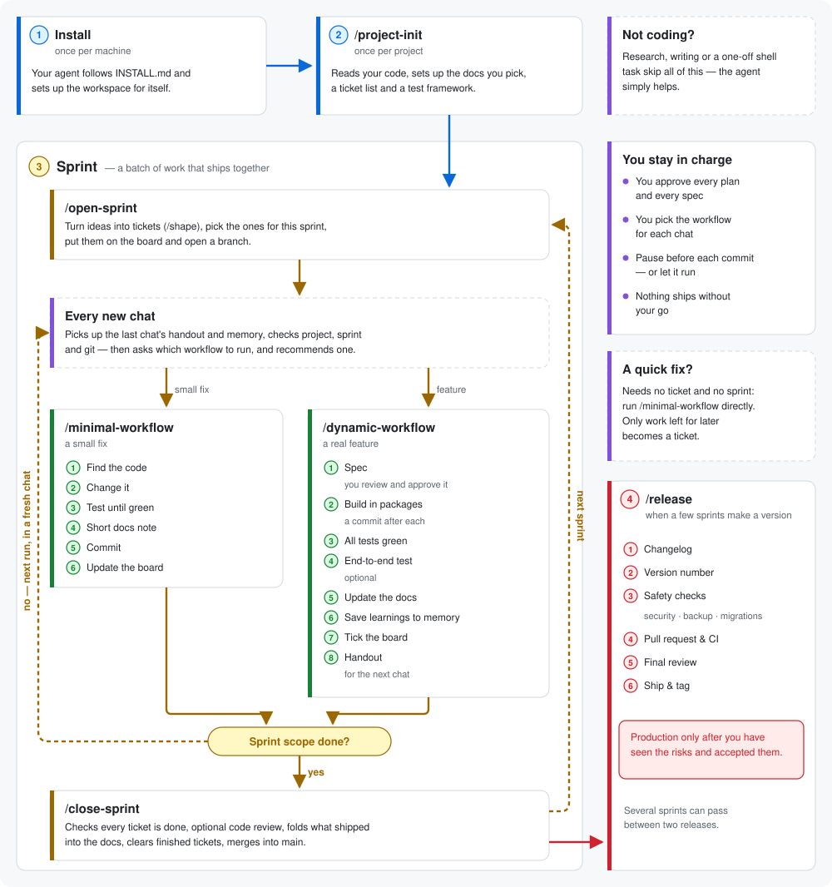
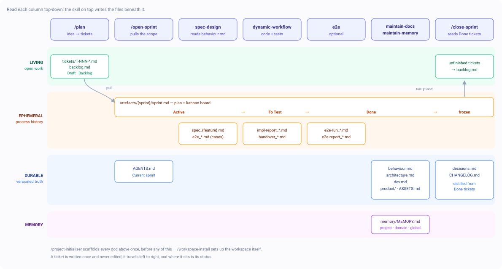

# Lean Coding Workspace

An opinionated setup for Claude Code, Codex and OpenCode: a global instruction file
plus a set of skills that turn "ask an AI to code" into a repeatable process — plan, spec,
implement, test, document, ship.

It is **plain Markdown**. Nothing to build, no runtime, no lock-in. You install it once into
the selected harness home, and from then on every project you work on follows the same workflow.

## Why

Coding agents are strong at writing code and weak at everything around it. Left alone they lose
the thread across sessions, re-litigate settled decisions, let docs rot, and answer structural
questions by reading half the repo. This workspace fixes that with three ideas:

- **Workflows over vibes.** Development work goes through a named pipeline whose steps are fixed.
  You pick the size of the pipeline, not whether to have one.
- **Every fact has exactly one home.** Durable truth in `docs/`, open work in `backlog/`, process
  history in `artefacts/`, machine-specific facts in memory. No fact lives in two places, so
  nothing silently goes stale.
- **A lean always-loaded core.** The global instruction file says *when* something applies and
  *where* the rest lives — about 2.3k tokens. Everything else is a skill, loaded only when used.

## Requirements

- A harness: Claude Code (verified) · Codex (agents need a format transform, dispatch unverified) ·
  OpenCode (paths unconfirmed — the installer asks)
- Git
- Three plugins, installed for you by the sync: `superpowers`, `codegraph`, `context7`
- Optional, offered during install: the `github` plugin and the `gh` CLI — needed for the PR flow
  and for releases, skippable if you only work locally
- Optional, for dispatch: OpenCode plus a model endpoint (a local server, a vendor key, an
  aggregator). Only needed to run a step on a model your harness does not sell

## Install

Open your harness anywhere and say:

> Fetch https://raw.githubusercontent.com/voxlo-dev/Lean-Coding-Workspace/main/INSTALL.md and follow it.

One that would rather not fetch: clone this repo and point it at [`INSTALL.md`](INSTALL.md) on disk.
The guide clones, runs the `workspace-sync` skill, then fills in who you are and what your machine
is — plain prose rather than a skill, so an agent *or* a human can follow it before anything exists.

The sync copies the workspace once into `~/.agents/` — skills, memory, domains and the project
scaffold, shared by every harness; `skills/` there is the Agent Skills standard, which Codex,
OpenCode, Gemini CLI and Cursor all read and Claude Code is linked into. Per harness it installs only
what that harness reads at a fixed path — the instruction file and the agents — plus its overlay, and
verifies each capability actually works rather than merely exists.

**Restart each changed harness afterwards.** New skill folders are only discovered in a fresh session.

Re-running `workspace-sync` from the clone is the **repair path**: it overwrites workspace-owned
skills, agents and project scaffolding, merges shared instructions and preserves user-owned memory,
projects, domains and configuration. It lives in the repo rather than in the installed workspace,
because the template it copies from lives there too.

## How a session goes

<p align="center">
  
</p>

Concretely, at the start of a chat the agent picks up any checkpoint the previous chat left, checks
the project's memory, then asks which workflow to use and recommends one. Before it starts it runs
a short preflight: is the project initialised, which sprint are we in, is the git tree clean.

Non-development work — writing, research, a one-off shell task — skips all of this. The workflow
gate applies to code only.

## The workflows

| Skill | Reach for it |
| --- | --- |
| `/minimal-workflow` | one small, well-scoped change or bugfix — no spec |
| `/dynamic-workflow` | the default for real features: spec → implement → green suite → optional e2e → docs → memory → board |
| `/localagent-workflow` | (experimental) a build that must stay robust on a weak or local (~30B) model: sequential, context-frugal, forced TDD |
| `/plan` | **first**, whenever a fuzzy idea or brainstorm has to become concrete work. Output is tickets, never a plan file |

Supporting skills, mostly invoked by the workflows rather than by you:

| Skill | Role |
| --- | --- |
| `/project-initialiser` | onboard a repo: explore, detect domain, scaffold docs, install test framework, migrate existing docs |
| `/open-sprint` · `/close-sprint` | open and close a sprint (see below); also the entry point for a brand-new project |
| `/release` | publish a version: changelog, version bump, security gate, PR, CI, audit, ship, tag |
| `spec-design` | stage 1 of `dynamic-workflow`: brainstorm, design the UI, decide the test + implementation strategy, write the spec |
| `e2e` | optional end-to-end validation stage; grows a driver script step by step, driving by agent only where a script can't reach |
| `ui-design` | look and feel — colors, typography, layout, mockups, design system |
| `maintain-docs` · `maintain-memory` | the docs and memory steps; both prune as well as write |
| `/checkpoint` | end a chat at a phase boundary: a short untracked handout the next chat reads and deletes |
| `/domain-initialiser` | build a domain master (see below) |
| `workspace-sync` | sync and repair an install (in this repo, not the workspace) |

## Work items — the Markdown kanban

Every unit of work is a **ticket** file: `backlog/T-NNN-{slug}.md`, holding *what* and *why*,
category, importance, effort and dependencies. A ticket stays editable for its whole life — what
is fixed is its altitude, not its wording.

The file never moves. Boards only *index* it, and it appears on exactly one of them:

- **`backlog/backlog.md`** — living, survives sprints. Columns **Draft** · **Backlog**: everything
  not yet pulled. Open *decisions* live here too, as `decision` tickets, and the next free ticket
  number sits at the top so no run has to derive it.
- **`artefacts/{sprint}/sprint.md`** — the sprint file: plan on top, board underneath. One line per
  ticket carrying a status token **open · active · to test · done**. That board *is* the sprint
  scope, and it freezes when the sprint closes.

When a sprint closes, its finished tickets are **dissolved** — the files are deleted once their
durable truth has graduated into the docs, and git history keeps the rest. So `backlog/` only ever
holds live work instead of growing forever.

A fix you do on the spot needs no ticket. The board captures what *isn't* being done right now.

Decisions get two homes, written in one move the moment one is settled: the reasoning as a section
in `artefacts/{sprint}/sprint-decisions.md`, and one line in `docs/decisions.md` — the flat,
append-only index that keeps "what is already decided here?" a single cheap read.

**A sprint is not a run.** It holds many runs, plans and specs. `/open-sprint` pulls tickets from
the backlog onto a fresh board and cuts a branch; `/close-sprint` clears the board, distils what
shipped into the durable docs, and merges. Everything in `artefacts/{sprint}/` stays correctable
while the sprint runs and freezes only at close — a spec is the sprint's working truth, not an
archive from the moment it is written.

**A sprint is not a release either.** Sprints integrate into `main`; a published version spans as
many of them as it needs. `/release` cuts one afterwards: changelog composed from the sprint
archives since the last tag, version bump, dependency and secret gate, a PR against the `release`
branch, CI, an audit of the release itself rather than of code already reviewed at each close, then
ship and tag. The changelog is a **release artifact**, not a repo doc — it lives in the PR body and
the GitHub release, while the repo keeps the sprint archives and the tag.

## How it all connects

Every skill has a lane, and every file it produces has a lifespan. Read a column top-down: the
skill on top writes what sits beneath it. Read the board left to right: that's the journey of one
ticket, and where it sits *is* its status.

<p align="center">
  
</p>

The two directions matter more than the boxes. **Left to right** is how work travels: an idea
becomes a ticket, gets pulled onto a board, gets a spec, becomes code, and ends up distilled into
durable docs — with whatever didn't get finished carried back to the backlog. **Top to bottom** is
ownership: exactly one skill writes each file, which is why nothing here has two versions of the
same truth.

Note what is *not* in the durable band: no skill writes a fact there while the work is still in
flight. Specs, reports and boards are process history, deliberately frozen and forgotten;
`maintain-docs` and `close-sprint` distil what survives into `docs/`.

## What a project looks like

```
project/
├── AGENTS.md              ← domain, structure, code style, current sprint (for contributors & agents)
├── README.md              ← for your users
├── backlog/               ← LIVING: open work, dissolved once it ships
│   ├── backlog.md         ←   index of everything not yet pulled + the ticket counter
│   └── T-NNN-{slug}.md    ←   one file per unit of work
├── docs/                  ← DURABLE: truth about the shipped system
│   ├── behaviour.md       ←   how the product behaves, as a rulebook — written at sprint close
│   ├── decisions.md       ←   settled decisions, one line each + the decision counter
│   ├── architecture.md    ←   planned/implemented structure
│   ├── dev.md             ←   setup, env, build/debug, dependency quirks
│   ├── release.md         ←   release runbook: version carriers, build & publish, the gate
│   └── product/           ←   end-user docs
└── artefacts/             ← EPHEMERAL: live while in flight, frozen once closed
    ├── {sprint}/          ←   one folder per sprint, frozen at its close
    │   ├── sprint.md      ←     the sprint file: frame, behaviour context, kanban board
    │   ├── sprint-decisions.md ← the reasoning behind what this sprint settled
    │   └── spec_*.md …    ←     specs, e2e files, reports
    └── release-{version}/ ←   one per published version, spanning the sprints since the last tag
```

Docs are split by **lifespan**, and you opt in per doc — a small project doesn't need all of them.
`docs/` is versioned truth, `backlog/` is open work, `artefacts/` is process history. That split is
what keeps the whole thing from turning into a swamp.

## Domains

A **domain** bundles everything specific to one kind of work — Unity, web frontend, Android, or a
non-coding craft like academic writing — as skills, agents, MCP servers, its own memory and the doc
sources they cite. It is capability and nothing else: no domain changes how a workflow runs, and the
build and release knowledge it carries only *seeds* a project's docs, which own it afterwards.

Masters live **inert** in `~/.agents/domains/{x}/`, so nothing domain-specific loads globally. The
bundle is harness-neutral; `project-initialiser` **projects** it into a repo, each part onto the path
that harness already scans — skills as a link (or a copy, if you want them in the repo), agents and
MCP servers into the harness's own directories, memory pointed back at the master. So the Unity MCP
runs in Unity repos and nowhere else.

**A project can install several**, as peers — a frontend and a backend domain in one tree project
into the same directories, and a name collision is raised rather than merged.

No masters ship with this repo — you build the ones you need with `/domain-initialiser`.

## Memory

Long-term memory is Markdown, curated by `maintain-memory`, in three scopes: **project**, **domain**
and **global**. Each file exists once and the installer points every harness at that one path — an
import or a config entry. Where a harness offers neither, that scope is readable but never loaded
automatically — a copy pasted into an instruction file goes stale the moment memory is written.
Machine-bound facts (absolute paths, local installs, personal tool setup) belong in memory;
system-independent engineering knowledge belongs in `docs/dev.md`. Never both.

## Making it yours

The whole workspace is Markdown — fork it and edit. Two things worth knowing:

- **Edit the template, not an install.** Installed skills, agents and project scaffolding are
  overwritten on every sync. Change `workspace_TEMPLATE/` in the repo, then re-run `workspace-sync`
  from it.
- **`AGENTS.md` is shared.** Your **User Info**, **System Info** and custom **RULES** survive a
  sync; the structural parts get merged. Keep it lean — it is loaded in every single session, and
  every token here is a token you pay for forever.
- **Only `adapters/` may name a harness.** Everything else is neutral — Claude Code reading
  `CLAUDE.md` instead of `AGENTS.md` is a two-line shim in its overlay, and that asymmetry lives
  nowhere else. A capability no overlay implements is reported as missing, never as working.

## Repo layout

```
workspace_TEMPLATE/            ← harness-neutral; installs to ~/.agents/ except where noted
├── AGENTS.md                  ←   shared global instruction file — per harness home
├── agents/                    ←   agent definitions, installed flat — per harness home
├── skills/                    ←   workflows and supporting skills
├── project_TEMPLATE/          ←   scaffold copied into each new project
├── domains/                   ←   domain master scaffold
├── memory/                    ←   global memory seed
└── DISPATCH-GUIDE_TEMPLATE.md ←   per-machine dispatch config, filled live, not installed
adapters/{harness}/            ← install overlay: the few files that differ, at the paths they land on
.agents/skills/workspace-sync/ ← the sync skill: it reads the two directories above, so it lives here
INSTALL.md                     ← the install guide, followable before any of this is installed
```
